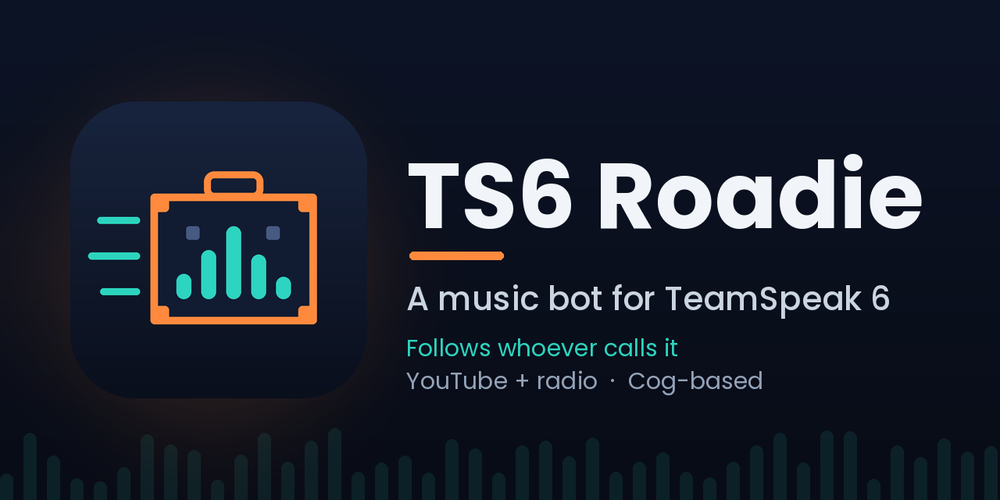

<p align="center"></p>

# TS6 Roadie

A music bot for **TeamSpeak 6** that carries the music to whoever asks for it. Structured like [Red-DiscordBot](https://github.com/Cog-Creators/Red-DiscordBot): a small core plus **cogs** you can load, unload and reload from chat.

- **Follows the caller.** Ask for music from any channel. If the bot is idle it joins *your* channel. If it is busy playing for someone else it tells you so, instead of yanking the music away from them.
- **YouTube** (and anything yt-dlp supports) by link or search words, plus **radio streams**.
- **No query interface needed.** It connects as a normal voice client, so the server's WebQuery / SSH / HTTP query interfaces can stay off.
- **No TeamSpeak client or virtual sound card.** It speaks the protocol itself and sends Opus audio directly.
- TypeScript on Node. Runs as a Windows service (NSSM) with a scripted install, update and roll-back process.

> **Status: early (0.x).** It has been tested against one TeamSpeak 6 server (build `6.0.0-beta12.1`). Details of what is and isn't verified are [below](#what-has-and-hasnt-been-verified). Expect rough edges, and please open an issue if you hit one.

## What has and hasn't been verified

| Verified on a real TS6 server | Verified by automated tests only | Not verified |
| --- | --- | --- |
| Connecting and the handshake, chat commands, admin checks, radio, YouTube search + playback, follow-the-caller, returning to the home channel when idle, use by a second person, running as a Windows service, restart on failure, starting automatically after a reboot, uploading the bot's avatar (`!avatar`), playlists (save, load, show, following the caller), updating a live Windows service with `deploy.mjs` | Command handling, cog load/unload/reload, config validation and migrations, the audio pipeline (ffmpeg to Opus to paced 20 ms packets), playlist editing, vote skip, permission rules by server group, install/update/roll-back script (against a fake service) | Redeeming a privilege key on first connect (`privilegeKey`), SoundCloud and Bandcamp playback (yt-dlp recognises their links; audio not yet tried on a real server), your server reporting users' server groups (check with `!whoami`), Linux service setup |

The TeamSpeak protocol code is a third-party library ([`@echosixhiya/teamspeak-client`](https://github.com/EchoSixHIYA/teamspeak-js), MIT). It is young. All use of it lives in one file, `src/adapter/teamspeak.ts`, behind an interface (`src/adapter/types.ts`). If it ever breaks against a server update, that file is the only place to change.

## Requirements

| Tool | Notes |
| --- | --- |
| **Node.js 22 LTS** (20.19 or newer) | https://nodejs.org |
| **ffmpeg** | On `PATH`, or set `audio.ffmpegPath` |
| **yt-dlp** | On `PATH`, or set `audio.ytdlpPath`. Keep it updated. |
| **A JavaScript runtime for yt-dlp** | YouTube needs one. Since you already have Node, add `"ytdlpExtraArgs": ["--js-runtimes", "node"]` to the config (see [YouTube](#youtube)). |
| **NSSM** *(Windows service only)* | https://nssm.cc. Use the **pre-release** (2.24-101 or newer). Plain 2.24 has a bug on Windows 10 / Server 2016 and newer, where services fail to start. |

## Quick start (try it without a service)

```bash
git clone https://github.com/knkwebservices/ts6-roadie.git
cd ts6-roadie
npm ci
npm run build
mkdir data
cp config.example.json data/config.json     # then edit it (see below)
npm run smoke                               # checks the handshake against your server
npm start
```

`npm ci` installs everything, including the pinned TeamSpeak library that ships in `vendor/`, so nothing extra needs to be downloaded or compiled.

### Edit `data/config.json`

At minimum:

- `server.address`: your server, `host` or `host:port` (default port 9987).
- `server.password`: only if your server has one.
- `server.homeChannel`: the channel the bot lives in and returns to.
- `admins`: your TeamSpeak **unique ID**. Leave the placeholder for now, start the bot, send it `!whoami`, and copy the `Unique ID` it prints. **Use that one:** the ID shown in the TeamSpeak client's settings screen can differ from the one the server reports, and the server's is the one the bot sees.

## Windows service install

The layout the scripts manage:

```
C:\tsbot\
  releases\<timestamp>-<version>\   each install or update is a complete separate copy
  current                           junction to the active release
  data\                             config.json, identity.json, logs (never touched by updates)
```

Run these in an **Administrator** PowerShell, one at a time. If `npm` is blocked with "running scripts is disabled", run `Set-ExecutionPolicy -Scope CurrentUser -ExecutionPolicy RemoteSigned` once.

```powershell
mkdir C:\tsbot\data
copy config.example.json C:\tsbot\data\config.json
notepad C:\tsbot\data\config.json
node scripts\deploy.mjs --root C:\tsbot --from . --no-service
```

The last command copies the project into `C:\tsbot\releases`, installs dependencies, points `C:\tsbot\current` at it, and **connects to your server once with a throwaway identity** to prove the handshake and channel list work. Wait for `SMOKE OK`. If it fails, read the error before going further.

Then register the service and start it:

```powershell
New-Item -ItemType Directory -Force C:\tsbot\data\logs | Out-Null; nssm install tsbot "C:\Program Files\nodejs\node.exe" dist\index.js; nssm set tsbot AppDirectory C:\tsbot\current; nssm set tsbot AppEnvironmentExtra TSBOT_DATA=C:\tsbot\data; nssm set tsbot AppExit Default Restart; nssm set tsbot AppRestartDelay 5000; nssm set tsbot AppStdout C:\tsbot\data\logs\service.out.log; nssm set tsbot AppStderr C:\tsbot\data\logs\service.err.log; nssm set tsbot AppRotateFiles 1; nssm set tsbot AppRotateBytes 5000000; nssm set tsbot Start SERVICE_AUTO_START
nssm start tsbot
```

**Back up `C:\tsbot\data\identity.json`.** It is the bot's TeamSpeak account. Lose it and the bot becomes a new user that needs its server group assigned again.

## TeamSpeak-side setup

The bot appears in the client list under its nickname. It needs a server group that lets it work:

- **Join** the channels people call it from (`i_channel_join_power`), including any channel passwords. If it can't join, the caller gets a clear message.
- **Talk** where it plays (`i_client_talk_power` for channels that require talk power).
- **See users in other channels** (`i_channel_subscribe_power`). The bot subscribes to all channels on connect so it knows where the caller is. If that is refused it falls back to asking the server per user.
- Optional: `b_client_ignore_antiflood`, so long queue listings never trip flood protection.

(Names are from the TS3 permission list; the TS6 editor may label them slightly differently.)

Assign the group by hand (right-click the bot in the client, Server Groups), or put a server-group **privilege key** in `privilegeKey` and restart. The key is redeemed once and never stored. That path has not been verified on a live server; if it logs a warning, assign by hand.

## Using it

Commands work as a **private message to the bot** (works from any channel, and is how "follow the caller" is triggered) or as **channel chat when the bot is in your channel**. TeamSpeak only delivers channel chat to the channel it was typed in, so the bot cannot hear chat in other rooms. Server-wide chat is answered privately.

| Command | What it does |
| --- | --- |
| `!play <link or words>` (`!p`) | Queue a YouTube or other link, or search. Playlist links queue up to 25 tracks. |
| `!radio [number\|name\|URL]` | No argument lists stations. Or give a direct stream URL. |
| `!queue` (`!q`), `!np` | What's playing and what's next |
| `!skip`, `!stop`, `!pause`, `!resume`, `!clear`, `!remove <n>`, `!shuffle`, `!volume [0-100]` | Playback control. You must be in the bot's channel (admins can always). |
| `!playlist save\|load\|list\|show\|add\|remove\|move\|rename\|delete` (`!pl`) | Save what is queued as a named playlist, edit it, and load it later. See [Playlists](#playlists). |
| `!voteskip` (`!vs`) | Vote to skip the current track. It skips once more than half of the people in the channel agree. See [Vote skip and permissions](#vote-skip-and-permissions). |
| `!summon` (`!join`) | Bring the bot to your channel |
| `!leave` (`!home`) | Stop and go back to the home channel |
| `!help [command]`, `!ping`, `!whoami` | Everyone |
| `!status`, `!cogs`, `!load`, `!unload`, `!reload`, `!restart` | Admins only |
| `!avatar [clear]` | Admins only. Uploads the bot's avatar (the Roadie icon by default), or removes it. See [Avatar](#avatar). |

Behaviour worth knowing:

- **Busy means protected.** While playing for a group in one channel, requests from other channels are politely declined. An admin's `!summon` overrides.
- **Alone means leave.** If nobody else is in its channel for `follow.aloneLeaveSeconds` (default 60) it stops and goes home. After the queue empties it goes home after `follow.idleReturnSeconds` (default 120).
- **Radio can't be paused** (a live stream has no position), so `!pause` on radio stops it. A station stays in the queue until skipped.
- Links are checked so the bot won't fetch from localhost or private network addresses.
- **Other sites.** SoundCloud and Bandcamp links work like YouTube ones (yt-dlp handles them), and SoundCloud sets and Bandcamp albums queue up to `audio.maxPlaylistItems` tracks. Spotify links cannot be played, because Spotify's audio is protected. The bot says so and suggests searching for the song by name.

## Configuration

`data/config.json` is merged over sensible defaults, validated on start (all problems reported at once), and versioned (`configVersion`). If a future release changes the format, the bot backs your file up as `config.json.v1.bak` and upgrades it. A config from a *newer* release than the one running is refused rather than misread. See `config.example.json`. Notable settings:

| Setting | Meaning |
| --- | --- |
| `server.homeChannel` | Where the bot lives and returns to |
| `server.identityLevel` | Security level of the bot's identity (default 10). Raise it if a server demands more; higher levels take exponentially longer to generate. |
| `voteskip.threshold` | A skip needs MORE than this fraction of the listeners to vote (default `0.5`, a majority; `0` means one vote is enough) |
| `permissions.commands` | Per-command access rules by server group or unique ID. See [Vote skip and permissions](#vote-skip-and-permissions). |
| `playlists.maxPlaylists` / `playlists.maxTracks` | How many playlists the server may hold (default 50) and the longest one in tracks (default 100) |
| `avatar.file` | Image for the bot's avatar (PNG, JPEG or GIF). Empty = the bundled Roadie icon. A relative path is relative to the data folder. |
| `avatar.applyOnConnect` | Set the avatar automatically each time the bot connects, skipping the upload if the server already shows it (default `true`) |
| `audio.codec` | `5` = Opus Music (stereo, default). Try `4` if a server only accepts voice. |
| `audio.bitrate` | Opus bitrate in bit/s (default 64000) |
| `audio.radioStations` | Your own stations: `{ "key": { "name": "...", "url": "https://..." } }`. Replaces the built-in SomaFM list, whose URLs are not guaranteed, so check them. |
| `audio.ytdlpExtraArgs` | Extra yt-dlp arguments, e.g. `["--js-runtimes","node"]` or `["--cookies","C:\\path\\cookies.txt"]` |

### Vote skip and permissions

**Vote skip.** `!voteskip` (or `!vs`) lets the people in the bot's channel decide together. The track skips once more than `voteskip.threshold` of the people listening (default `0.5`, a majority) have voted. Votes belong to one track, and someone who leaves the channel stops counting. Alone with the bot, one vote skips at once.

**Permissions.** By default anyone can use the music commands and only bot admins (the unique IDs in `admins`) can use the admin ones. To change that for a particular command, add a rule:

```json
"permissions": {
  "commands": {
    "play":   { "groups": [12] },
    "skip":   { "groups": [12], "uids": ["abc123...="] },
    "status": { "groups": [7] }
  }
}
```

A command with a rule is limited to bot admins plus the listed server groups and unique IDs. That works both ways: it can restrict an everyday command (only the DJ group may `!play`) or hand an admin command to a group (moderators may `!status`). An empty rule, `{}`, means admins only. Rules are keyed by the command name, and an alias works too. The bot warns at start-up about any rule that matches no command, which is nearly always a typo.

To find a group's ID, send the bot `!whoami`: it lists the server groups the server reports for you. A common setup is to restrict `skip` to a DJ group and leave `!voteskip` open, so everyone else has to vote.

### Playlists

The `playlists` cog saves what is currently playing and queued under a name, so a group can bring back its favourites with one command instead of searching every time.

```
!playlist save friday night              saves the current track plus the queue
!playlist load friday night              queues it (the bot follows you, exactly like !play)
!playlist list                           every saved playlist
!playlist show friday night              the tracks in one, with their positions
!playlist add friday night | never gonna give you up   adds a track (a link or search words); creates the playlist if new
!playlist remove friday night 2          removes track 2
!playlist move friday night 3 1          moves track 3 to position 1
!playlist rename friday night > weekend  renames it
!playlist delete friday night            removes it
```

Anyone can load a playlist. Only the person who saved it, or a bot admin, can overwrite, edit, rename or delete it, and an admin overwriting keeps the original owner. Names are 1-32 letters, numbers, spaces or `_ . ' -` and are not case-sensitive. Playlists live in `data/playlists.json`, written safely so a crash cannot corrupt them. If that file is ever damaged by hand-editing, the bot moves it aside as `playlists.json.broken-<time>` and starts empty rather than overwriting it. Links in the file are checked again on load, so a hand-edit cannot make the bot fetch from a private address.

If you are updating an existing install, add `"playlists"` (and `"voteskip"` for vote skip) to `cogs` in your config.

### Avatar

The `avatar` cog gives the bot a picture in the TeamSpeak client. By default it uses the bundled Roadie icon (`assets/roadie-avatar.png`) and sets it each time the bot connects, unless the server already shows that exact image. Set `avatar.file` to use your own image, `avatar.applyOnConnect` to `false` to turn the automatic part off, or remove `avatar` from `cogs` to drop the feature. `!avatar` (admins) re-uploads on demand and `!avatar clear` removes it. If you are updating an existing install, add `"avatar"` to `cogs` in your config.

It uses TeamSpeak's file-transfer feature, so two things must be true:

- The bot must be able to open a **TCP connection to the server's file-transfer port** (the server tells the bot which port; TeamSpeak's default is 30033). If that port is blocked, the log says `could not reach the server's file-transfer port (TCP nnnnn ...)`. Open that port in the server's firewall.
- The bot's server group needs permission to upload a file and set an avatar of that size (in the TS3 permission list: `i_client_max_avatar_filesize` and the `i_ft_file_upload_power` family). If the server refuses, the reason is in the log and in the `!avatar` reply.

A failed automatic upload only writes a warning to the log. It never posts in chat.

### YouTube

YouTube changes often, and old yt-dlp versions stop working, so **keep yt-dlp current**. On Windows, a scheduled task does it:

```powershell
Register-ScheduledTask -TaskName 'yt-dlp update' -Action (New-ScheduledTaskAction -Execute 'C:\tools\yt-dlp.exe' -Argument '-U') -Trigger (New-ScheduledTaskTrigger -Daily -At 4am) -User 'SYSTEM' -RunLevel Highest
```

If yt-dlp reports "no supported JavaScript runtime", add `["--js-runtimes","node"]` to `ytdlpExtraArgs`. If it reports "sign in to confirm you're not a bot", export a cookies file and add `["--cookies","<path>"]`.

Fetching audio from YouTube may conflict with YouTube's terms of service. Roadie does not bundle or ship any of that machinery, and using it is your responsibility.

## Updating

```powershell
# from a zip or folder:
node scripts\deploy.mjs --root C:\tsbot --from C:\downloads\ts6-roadie-0.3.0.zip
# or straight from a git repo and tag:
node scripts\deploy.mjs --root C:\tsbot --from https://github.com/knkwebservices/ts6-roadie.git --ref v0.3.0
```

It builds the new release next to the running one, **smoke-tests it against your real server** (if that fails, nothing is touched), stops the service, switches `C:\tsbot\current`, starts the service, and waits for the new bot to report that it is connected. If that doesn't happen within 90 seconds, the previous release is put back automatically. `data\` is never touched. The newest 3 releases are kept.

Manual rollback: `node scripts\deploy.mjs --root C:\tsbot --rollback`

**Updating the TeamSpeak protocol library** (only if a server update breaks the bot and the library author has released a fix): on a dev machine run `npm run vendor:ts -- <commit-or-tag>`, then `npm test`, then deploy. The library is vendored as a pinned tarball, so nothing changes underneath you between deploys.

## Adding features: cogs

A cog is a folder with an `index.js` or `index.mjs` that exports a `manifest` and a default factory. Drop your own in **`data/cogs/<name>/index.mjs`** and it survives updates. Minimal example, `data/cogs/hello/index.mjs`:

```js
export const manifest = { name: 'hello', version: '1.0.0', description: 'Says hello' };

export default (bot) => ({
  commands: [{
    name: 'hello',
    description: 'Greet the caller',
    run: (ctx) => ctx.reply(`Hi ${ctx.msg.senderName}!`),   // add perm: 'admin' to restrict
  }],
});
```

Cogs can offer things to each other without importing one another: a cog calls `bot.services.provide(name, service)` when it loads (and the function it returns when it unloads), and another cog calls `bot.services.get(name)` when it needs it, coping with `undefined` if the other cog is not loaded. The audio cog offers an `audio` service (see `src/core/services.ts`): `snapshot()` for what is queued, and `queue(ctx, items)` to queue tracks for the caller exactly as `!play` does. The playlists cog is built on it.

Then `!load hello`. Editing the file and running `!reload hello` picks up the change, and if the new version has an error the old one stays loaded. `!reload` re-reads a cog's *entry file* only, so if you split a cog across files, changes to the others need `!restart`. The folder name must equal `manifest.name`, and two cogs cannot claim the same command. The built-in `core` cog cannot be unloaded. Add the name to `cogs` in the config to load it at start-up.

## Troubleshooting

Logs: `data/logs/tsbot-YYYY-MM-DD.log` (14 days kept). Set `"logLevel": "debug"` for protocol detail.

- **Smoke test or bot can't connect.** The protocol library identifies itself to the server as a TS3-era client, and a beta server may react differently. The log says what the server answered. Please include those lines in an issue.
- **"insufficient security level".** Raise `server.identityLevel` gradually.
- **The bot ignores commands in channel chat.** It only hears channel chat in its *own* channel. Private-message it, or `!summon` first.
- **`Bot admin: no` for the right person.** Compare the `Unique ID` printed by `!whoami` with `admins`. Use the one `!whoami` prints.
- **The bot joins but nobody hears it.** Talk power or server-group setup. Try `"codec": 4`.
- **"I can't tell which channel you're in".** The bot couldn't see you, usually the subscribe permission. Look for `channelsubscribeall failed` in the log.
- **`Could not set the avatar` / no avatar shows.** The message says why. The usual causes are the server's file-transfer TCP port being blocked (see [Avatar](#avatar)) or the bot's server group lacking upload or avatar permissions. Other users may need to reconnect, or wait a moment, before their client shows a changed avatar.
- **The bot process keeps restarting.** Anything uncaught makes it exit so the service manager restarts it. The log has the reason. A config error stops it from starting at all, with the problem named in the log.

## Development

```bash
npm ci
npm run typecheck
npm test          # ~60 tests; needs ffmpeg for the audio tests
npm run dev       # run from source (data in ./data, or set TSBOT_DATA)
```

Layout: `src/adapter/` (the TeamSpeak boundary), `src/core/` (bot, cog manager), `src/cogs/core` and `src/cogs/audio` (built-in cogs), `scripts/deploy.mjs`, `vendor/` (pinned protocol library), `test/`.

## License and credits

MIT. See `LICENSE`. Third-party components and their licenses are listed in `THIRD_PARTY_NOTICES.md`.

TeamSpeak is a registered trademark of TeamSpeak Systems GmbH. This project is not affiliated with, endorsed by, or associated with TeamSpeak Systems GmbH.
