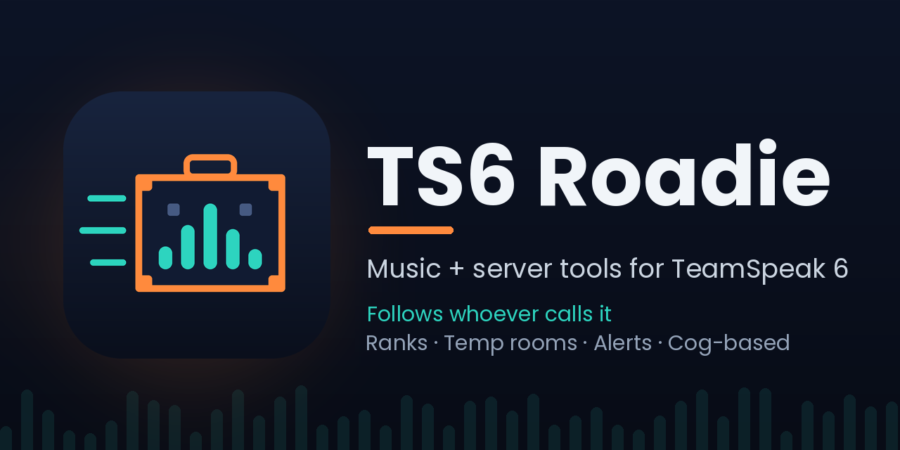

<p align="center"></p>

# TS6 Roadie

A music bot for **TeamSpeak 6** that carries the music to whoever asks for it. Structured like [Red-DiscordBot](https://github.com/Cog-Creators/Red-DiscordBot): a small core plus **cogs** you can load, unload and reload from chat.

Read how it was built and what it does on a real community server: [TS6 Roadie, a TeamSpeak 6 music bot](https://knkws.com/teamspeak-6-music-bot/).

- **Follows the caller.** Ask for music from any channel. If the bot is idle it joins *your* channel. If it is busy playing for someone else it tells you so, instead of yanking the music away from them.
- **YouTube** (and anything yt-dlp supports) by link or search words, plus **radio streams**.
- **No query interface needed.** It connects as a normal voice client, so the server's WebQuery / SSH / HTTP query interfaces can stay off.
- **No TeamSpeak client or virtual sound card.** It speaks the protocol itself and sends Opus audio directly.
- TypeScript on Node. Runs as a Windows service (NSSM) with a scripted install, update and roll-back process.

> **Status: early (0.x).** It has been tested against one TeamSpeak 6 server (build `6.0.0-beta12.1`). Details of what is and isn't verified are [below](#what-has-and-hasnt-been-verified). Expect rough edges, and please open an issue if you hit one.

## What has and hasn't been verified

| Verified on a real TS6 server | Verified by automated tests only | Not verified |
| --- | --- | --- |
| Connecting and the handshake, chat commands, admin checks, radio, YouTube search + playback, follow-the-caller, returning to the home channel when idle, use by a second person, running as a Windows service, restart on failure, starting automatically after a reboot, uploading the bot's avatar (`!avatar`), playlists (save, load, show, following the caller), updating a live Windows service with `deploy.mjs`, playlist editing, vote skip, SoundCloud and Bandcamp links, your server reporting users' server groups (`!whoami`), Spotify song links (and the album message), radio song titles from a real station | Command handling, cog load/unload/reload, config validation and migrations, the audio pipeline (ffmpeg to Opus to paced 20 ms packets), permission rules by server group, the web dashboard (real HTTP requests plus the real page driven in a simulated browser), install/update/roll-back script (against a fake service), Steam status tracking (against a fake Steam API), server analytics (sampling, uptime tracking, song-history aggregation), Twitch live alerts (against a fake Twitch API, including app-token refresh), the support notifier, live channel names, `!seen` and the online record, temporary rooms, ranks for time online, protected server groups, event reminders, rotating announcements, the nickname filter (against a fake server) | Redeeming a privilege key on first connect (`privilegeKey`), the web dashboard in a real browser, Linux service setup, Steam status tracking against the real Steam API, Twitch live alerts against the real Twitch API, renaming channels on a real server (live channel names), temporary rooms on a real server (creating the channel, the owner's channel group, the server deleting an empty room), adding and removing server groups on a real server (ranks, group protection), server-wide chat, pokes and kicks on a real server (events, announcements, nickname filter) |

The TeamSpeak protocol code is a third-party library ([`@echosixhiya/teamspeak-client`](https://github.com/EchoSixHIYA/teamspeak-js), MIT). It is young. All use of it lives in one file, `src/adapter/teamspeak.ts`, behind an interface (`src/adapter/types.ts`). If it ever breaks against a server update, that file is the only place to change.

## Requirements

| Tool | Notes |
| --- | --- |
| **Node.js 22 LTS** (20.19 or newer) | https://nodejs.org |
| **ffmpeg** | On `PATH`, or set `audio.ffmpegPath` |
| **yt-dlp** | On `PATH`, or set `audio.ytdlpPath`. Keep it updated. |
| **A JavaScript runtime for yt-dlp** | YouTube needs one. Since you already have Node, add `"ytdlpExtraArgs": ["--js-runtimes", "node"]` to the config (see [YouTube](#youtube)). |
| **NSSM** *(Windows service only)* | https://nssm.cc. Use the **pre-release** (2.24-101 or newer). Plain 2.24 has a bug on Windows 10 / Server 2016 and newer, where services fail to start. |

## Quick start (try it without a service)

```bash
git clone https://github.com/knkwebservices/ts6-roadie.git
cd ts6-roadie
npm ci
npm run build
mkdir data
cp config.example.json data/config.json     # then edit it (see below)
npm run smoke                               # checks the handshake against your server
npm start
```

`npm ci` installs everything, including the pinned TeamSpeak library that ships in `vendor/`, so nothing extra needs to be downloaded or compiled.

### Edit `data/config.json`

At minimum:

- `server.address`: your server, `host` or `host:port` (default port 9987).
- `server.password`: only if your server has one.
- `server.homeChannel`: the channel the bot lives in and returns to.
- `admins`: your TeamSpeak **unique ID**. Leave the placeholder for now, start the bot, send it `!whoami`, and copy the `Unique ID` it prints. **Use that one:** the ID shown in the TeamSpeak client's settings screen can differ from the one the server reports, and the server's is the one the bot sees.

## Windows service install

The layout the scripts manage:

```
C:\tsbot\
  releases\<timestamp>-<version>\   each install or update is a complete separate copy
  current                           junction to the active release
  data\                             config.json, identity.json, logs (never touched by updates)
```

Run these in an **Administrator** PowerShell, one at a time. If `npm` is blocked with "running scripts is disabled", run `Set-ExecutionPolicy -Scope CurrentUser -ExecutionPolicy RemoteSigned` once.

```powershell
mkdir C:\tsbot\data
copy config.example.json C:\tsbot\data\config.json
notepad C:\tsbot\data\config.json
node scripts\deploy.mjs --root C:\tsbot --from . --no-service
```

The last command copies the project into `C:\tsbot\releases`, installs dependencies, points `C:\tsbot\current` at it, and **connects to your server once with a throwaway identity** to prove the handshake and channel list work. Wait for `SMOKE OK`. If it fails, read the error before going further.

Then register the service and start it:

```powershell
New-Item -ItemType Directory -Force C:\tsbot\data\logs | Out-Null; nssm install tsbot "C:\Program Files\nodejs\node.exe" dist\index.js; nssm set tsbot AppDirectory C:\tsbot\current; nssm set tsbot AppEnvironmentExtra TSBOT_DATA=C:\tsbot\data; nssm set tsbot AppExit Default Restart; nssm set tsbot AppRestartDelay 5000; nssm set tsbot AppStdout C:\tsbot\data\logs\service.out.log; nssm set tsbot AppStderr C:\tsbot\data\logs\service.err.log; nssm set tsbot AppRotateFiles 1; nssm set tsbot AppRotateBytes 5000000; nssm set tsbot Start SERVICE_AUTO_START
nssm start tsbot
```

**Back up `C:\tsbot\data\identity.json`.** It is the bot's TeamSpeak account. Lose it and the bot becomes a new user that needs its server group assigned again.

## TeamSpeak-side setup

The bot appears in the client list under its nickname. It needs a server group that lets it work:

- **Join** the channels people call it from (`i_channel_join_power`), including any channel passwords. If it can't join, the caller gets a clear message.
- **Talk** where it plays (`i_client_talk_power` for channels that require talk power).
- **See users in other channels** (`i_channel_subscribe_power`). The bot subscribes to all channels on connect so it knows where the caller is. If that is refused it falls back to asking the server per user.
- Optional: `b_client_ignore_antiflood`, so long queue listings never trip flood protection.
- Only for [temporary rooms](#temporary-rooms): creating temporary channels (`b_channel_create_temporary`, and `b_channel_create_child` to make them as sub-channels), moving people, and assigning channel groups (`i_group_member_add_power` high enough for the owner's channel group).
- Only for the [nickname filter](#nickname-filter): moving people (move mode) or kicking them (`i_client_kick_from_server_power`, kick mode).
- Only for [ranks and protected groups](#ranks-and-protected-groups): adding and removing people from server groups (`i_group_member_add_power` and `i_group_member_remove_power` at least as high as those groups' needed powers).
- Only for [live channel names](#server-tools-support-notifier-live-channel-names-and-seen): changing channel names (`b_channel_modify_name`).

(Names are from the TS3 permission list; the TS6 editor may label them slightly differently.)

Assign the group by hand (right-click the bot in the client, Server Groups), or put a server-group **privilege key** in `privilegeKey` and restart. The key is redeemed once and never stored. That path has not been verified on a live server; if it logs a warning, assign by hand.

## Using it

Commands work as a **private message to the bot** (works from any channel, and is how "follow the caller" is triggered) or as **channel chat when the bot is in your channel**. TeamSpeak only delivers channel chat to the channel it was typed in, so the bot cannot hear chat in other rooms. Server-wide chat is answered privately.

| Command | What it does |
| --- | --- |
| `!play <link or words>` (`!p`) | Queue a YouTube or other link, or search. Playlist links queue up to 25 tracks. |
| `!radio [number\|name\|URL]` | No argument lists stations. Or give a direct stream URL. |
| `!queue` (`!q`), `!np` | What's playing and what's next. For a radio station, `!np` also shows the song it is playing right now. |
| `!skip`, `!stop`, `!pause`, `!resume`, `!clear`, `!remove <n>`, `!shuffle`, `!volume [0-100]` | Playback control. You must be in the bot's channel (admins can always). |
| `!search <words>`, `!pick <number>` | Search YouTube and choose from five results: `!search lofi beats`, then `!pick 2`. Your results are yours alone and last five minutes. |
| `!history [n]` (`!recent`), `!again <#number>` (`!replay`) | What was played recently, newest first, and play one of them again. |
| `!seek <1:30 \| 90 \| +30 \| -30>` | Jump within the current track (not live radio). |
| `!repeat [off\|track\|queue]` (`!loop`) | Repeat the current track or the whole queue. Live radio is never repeated. |
| `!move <from> <to>` | Move a queued track to another position. |
| `!playlist save\|load\|list\|show\|add\|remove\|move\|rename\|delete` (`!pl`) | Save what is queued as a named playlist, edit it, and load it later. See [Playlists](#playlists). |
| `!voteskip` (`!vs`) | Vote to skip the current track. It skips once more than half of the people in the channel agree. See [Vote skip and permissions](#vote-skip-and-permissions). |
| `!weblogin` | Get a one-time code (sent privately) to sign in to the [web dashboard](#web-dashboard) |
| `!summon` (`!join`) | Bring the bot to your channel |
| `!leave` (`!home`) | Stop and go back to the home channel |
| `!goto <channel name>` | Admins only. Send the bot to a channel by name, or as `#<id>`. |
| `!autodj [on\|off\|source radio <station>\|source playlist <name>]` | Admins only. See [Auto-DJ and 24/7](#auto-dj-and-247). |
| `!stay [on\|off]` (`!247`) | Admins only. 24/7 mode: stay in the current channel. |
| `!afk`, `!welcome`, `!widget` | Admins only. The [community tools](#community-tools-afk-mover-welcome-message-and-public-widget): AFK mover, welcome message and public widget. |
| `!steam [check\|add\|remove\|interval]` | Plain `!steam` (everyone) lists tracked players and what they're playing. The rest are admin-only. See [Steam status](#steam-status). |
| `!analytics` (`!stats`) `[hours\|channels\|songs\|on\|off\|interval\|reset]` | Plain `!analytics` (everyone) shows a summary. The rest are admin-only. See [Server analytics](#server-analytics). |
| `!twitch` (`!live`) `[check\|add\|remove\|interval]` | Plain `!twitch` (everyone) lists tracked channels and who's live. The rest are admin-only. See [Twitch live alerts](#twitch-live-alerts). |
| `!seen <name>` (`!lastseen`), `!record` | Everyone (`!record reset` is for bot admins). When someone was last online, and the most people ever online at once. See [Server tools](#server-tools-support-notifier-live-channel-names-and-seen). |
| `!oh <name>` (`!oncehuman`), `!icarus <name>` (`!ic`) | Everyone. Look up a weapon, item, recipe, creature and more for Once Human or Icarus. See [Once Human and Icarus lookups](#once-human-and-icarus-lookups). |
| `!nukes [alpha\|bravo\|charlie]` (`!nuke`), `!minerva [list]` | Everyone. This week's Fallout 76 nuke codes, and where Minerva is and when she comes next. `!minerva add`/`remove` are for bot admins. See [Fallout 76](#fallout-76-nuke-codes-and-minerva). |
| `!events`, `!event <number>`, `!going [number]`, `!notgoing [number]` | Everyone. Events coming up, and signing up for a poke when one starts. `!event add` and `!event remove` are for bot admins by default. See [Events and announcements](#events-and-announcements). |
| `!announce`, `!nickfilter` | Admins only. Rotating announcements and the nickname filter. See [Events and announcements](#events-and-announcements) and [Nickname filter](#nickname-filter). |
| `!room` (`!myroom`), `!rooms` | `!room` (everyone) takes you to your own temporary room. `!rooms` (admins) sets them up. See [Temporary rooms](#temporary-rooms). |
| `!rank [name]` (`!hours`), `!ranks`, `!protect` | `!rank` (everyone) shows time online and rank. `!ranks` and `!protect` are admin-only. See [Ranks and protected groups](#ranks-and-protected-groups). |
| `!staff` (`!admins`) | Everyone. Which staff are online right now, and where. `!staff add`/`remove <group ID>` (bot admins) chooses which server groups count. See [Staff online](#staff-online). |
| `!game <name>` (`!role`), `!games` | Everyone. Give yourself a game's server group (like "Fallout 76 Player"), or take it away. Admins set them up. See [Game groups](#game-groups). |
| `!mychannel [giveup]` (`!mych`) | Everyone. Go to your own private channel, or give it up. See [Private channels and the cleaner](#private-channels-and-the-channel-cleaner). |
| `!privchannels`, `!cleaner` | Admins only. Set up private channels, and remove channels nobody uses. See [Private channels and the cleaner](#private-channels-and-the-channel-cleaner). |
| `!report <name> <what happened>` | Everyone. Privately tells the staff online about a problem, and saves it for the rest. See [Jail, reports and meetings](#jail-reports-and-meetings). |
| `!jail`, `!unjail`, `!jailed`, `!reports`, `!meeting` | Admins only. Keep someone in a jail channel for a while, read reports, and pull the staff together. See [Jail, reports and meetings](#jail-reports-and-meetings). |
| `!ipguard`, `!whois <name>` | Admins only. VPN/proxy, clone and country checks on people joining, and what the server says about someone (privately). See [IP guard](#ip-guard-vpn-proxy-clones-and-countries). |
| `!floodguard`, `!banner` | Admins only. The channel-hopping and chat-spam guard, and the live stats banner. See [Flood guard](#flood-guard) and [Stats banner](#stats-banner). |
| `!notify`, `!livename` | Admins only. The support notifier and live channel names. See [Server tools](#server-tools-support-notifier-live-channel-names-and-seen). |
| `!hideme [on\|off]` (`!hide`) | Leave your name off the public widget (you still count in the total). |
| `!tools`, `!ytcheck`, `!ytupdate` | Admins only. Tool versions, a YouTube playback test, and a yt-dlp update. See [YouTube](#youtube). |
| `!block <name or #number> [minutes]`, `!unblock`, `!blocklist`, `!blockword`, `!unblockword` | Admins only. See [Keeping trolls out](#keeping-trolls-out). |
| `!help [command]`, `!ping`, `!whoami` | Everyone |
| `!status`, `!cogs`, `!load`, `!unload`, `!reload`, `!restart` | Admins only |
| `!avatar [clear]` | Admins only. Uploads the bot's avatar (the Roadie icon by default), or removes it. See [Avatar](#avatar). |

Behaviour worth knowing:

- **Busy means protected.** While playing for a group in one channel, requests from other channels are politely declined. An admin's `!summon` overrides.
- **Alone means leave.** If nobody else is in its channel for `follow.aloneLeaveSeconds` (default 60) it stops and goes home. After the queue empties it goes home after `follow.idleReturnSeconds` (default 120).
- **Radio can't be paused** (a live stream has no position), so `!pause` on radio stops it. A station stays in the queue until skipped.
- Links are checked so the bot won't fetch from localhost or private network addresses.
- **Other sites.** SoundCloud and Bandcamp links work like YouTube ones (yt-dlp handles them), and SoundCloud sets and Bandcamp albums queue up to `audio.maxPlaylistItems` tracks.
- **Spotify song links** work too, without any Spotify account or keys: the bot reads the song and artist from the link and plays the best YouTube match, so it can occasionally pick a live version or a cover. Spotify's audio itself is protected and is never used. Spotify albums, playlists and podcasts can't be played from a link, because Spotify doesn't share their track lists, and the bot says so.
- **Radio song titles.** While a station plays, the bot can read the song it announces, and `!np` shows it. That takes a second small connection to the station (about the same as the stream itself, a few KB/s) for as long as the radio track plays. Turn it off with `audio.radioNowPlaying`, or have each new title posted in the channel with `audio.announceRadioTitles`. Stations that don't announce titles are left alone.

## Configuration

`data/config.json` is merged over sensible defaults, validated on start (all problems reported at once), and versioned (`configVersion`). If a future release changes the format, the bot backs your file up as `config.json.v1.bak` and upgrades it. A config from a *newer* release than the one running is refused rather than misread. See `config.example.json`. Notable settings:

| Setting | Meaning |
| --- | --- |
| `server.homeChannel` | Where the bot lives and returns to |
| `server.identityLevel` | Security level of the bot's identity (default 10). Raise it if a server demands more; higher levels take exponentially longer to generate. |
| `voteskip.threshold` | A skip needs MORE than this fraction of the listeners to vote (default `0.5`, a majority; `0` means one vote is enough) |
| `community.afk.*` / `community.welcome.*` | The [AFK mover and welcome message](#community-tools-afk-mover-welcome-message-and-public-widget), from the `community` cog (add `"community"` to `cogs`). `afk`: `enabled`, `channel` (default "AFK Room"), `minutes` (30), `warnSeconds` (60), `checkSeconds` (30), `exemptGroups` (server-group IDs), `ignoreChannels` (names). `welcome`: `enabled`, `message`, `cooldownSeconds` (60). |
| `steam.*` | [Steam status](#steam-status), from the `steam` cog (add `"steam"` to `cogs`). `enabled`, `apiKey` (free, from https://steamcommunity.com/dev/apikey), `pollSeconds` (default 120), `players` (a list of `{ "steamId": "<17-digit SteamID64>", "label": "..." }`). |
| `analytics.*` | [Server analytics](#server-analytics), from the `analytics` cog (add `"analytics"` to `cogs`). `enabled`, `pollSeconds` (default 300, how often it samples who's online and where). |
| `twitch.*` | [Twitch live alerts](#twitch-live-alerts), from the `twitch` cog (add `"twitch"` to `cogs`). `enabled`, `clientId`/`clientSecret` (free, from https://dev.twitch.tv/console/apps), `pollSeconds` (default 120), `channels` (a list of `{ "login": "<twitch.tv/name>", "label": "..." }`). |
| `web.widget` | The public widget: `enabled`, `showNames`, and `origins`, the websites allowed to embed it or read its data, like `["https://tgscgaming.com"]` |
| `web.host` / `web.port` / `web.codeMinutes` / `web.sessionHours` / `web.publicUrl` | The [web dashboard](#web-dashboard): where it listens (this machine only, port 8787 by default), how long a login code works (5 minutes), how long a browser stays signed in (12 hours), and the public https address when a [reverse proxy](#putting-the-dashboard-on-the-internet) serves it (empty by default) |
| `permissions.commands` | Per-command access rules by server group or unique ID. See [Vote skip and permissions](#vote-skip-and-permissions). |
| `playlists.maxPlaylists` / `playlists.maxTracks` | How many playlists the server may hold (default 50) and the longest one in tracks (default 100) |
| `avatar.file` | Image for the bot's avatar (PNG, JPEG or GIF). Empty = the bundled Roadie icon. A relative path is relative to the data folder. |
| `avatar.applyOnConnect` | Set the avatar automatically each time the bot connects, skipping the upload if the server already shows it (default `true`) |
| `audio.codec` | `5` = Opus Music (stereo, default). Try `4` if a server only accepts voice. |
| `audio.bitrate` | Opus bitrate in bit/s (default 64000) |
| `audio.radioNowPlaying` / `audio.announceRadioTitles` | Read the current song from a radio station so `!np` can show it (default on), and post each new title in the channel (default off) |
| `audio.maxQueuePerUser` | How many tracks one person may have queued at once (default `0` = no limit; bot admins are exempt) |
| `audio.blockedWords` | Words that keep a track out of the queue when they are in its title or address, for everyone but admins (add more with `!blockword`) |
| `audio.radioRetries` / `audio.radioRetrySeconds` / `audio.radioFallback` | When a live station drops: how many times to reconnect (default 3, `0` = never), how long to wait before the first try (default 2 s, later tries wait longer), and a station to switch to if one will not come back (empty = none). See [Radio](#radio-that-keeps-going). |
| `audio.healthCheckHours` | Test YouTube playback this often and tell the online admins if it stops working (default 12, `0` = never) |
| `audio.autoDj` / `audio.stayInChannel` | Starting values for [Auto-DJ and 24/7 mode](#auto-dj-and-247); changes made with `!autodj` and `!stay` are remembered separately |
| `audio.radioStations` | Your own stations: `{ "key": { "name": "...", "url": "https://..." } }`. Replaces the built-in SomaFM list, whose URLs are not guaranteed, so check them. |
| `audio.ytdlpExtraArgs` | Extra yt-dlp arguments, e.g. `["--js-runtimes","node"]` or `["--cookies","C:\\path\\cookies.txt"]` |

### Vote skip and permissions

**Vote skip.** `!voteskip` (or `!vs`) lets the people in the bot's channel decide together. The track skips once more than `voteskip.threshold` of the people listening (default `0.5`, a majority) have voted. Votes belong to one track, and someone who leaves the channel stops counting. Alone with the bot, one vote skips at once.

**Permissions.** By default anyone can use the music commands and only bot admins (the unique IDs in `admins`) can use the admin ones. To change that for a particular command, add a rule:

```json
"permissions": {
  "commands": {
    "play":   { "groups": [12] },
    "skip":   { "groups": [12], "uids": ["abc123...="] },
    "status": { "groups": [7] }
  }
}
```

A command with a rule is limited to bot admins plus the listed server groups and unique IDs. That works both ways: it can restrict an everyday command (only the DJ group may `!play`) or hand an admin command to a group (moderators may `!status`). An empty rule, `{}`, means admins only. Rules are keyed by the command name, and an alias works too. The bot warns at start-up about any rule that matches no command, which is nearly always a typo.

To find a group's ID, send the bot `!whoami`: it lists the server groups the server reports for you. A common setup is to restrict `skip` to a DJ group and leave `!voteskip` open, so everyone else has to vote.

### Web dashboard

The `web` cog is a control panel in a browser: what is playing with a progress bar, pause, skip, stop and volume, the queue with remove buttons, a box to add music by link or search, one-click radio stations, your saved playlists, and the bot's replies. It is **off by default**. To turn it on, add `"web"` to `cogs` in your config and restart the bot.

**It only listens on the machine the bot runs on** (`127.0.0.1`), and the config refuses any other listen address. Out of the box nothing is exposed to the internet: open it in a browser on the bot's own machine (for example over Remote Desktop) at `http://127.0.0.1:8787`. To use it from anywhere, see [Putting the dashboard on the internet](#putting-the-dashboard-on-the-internet).

**Signing in.** There are no passwords. Send the bot `!weblogin` in TeamSpeak. It replies **privately** with a short one-time code such as `K7M2-9QXP`. Type it into the page. The code works once and expires after 5 minutes, and repeated wrong guesses are locked out. You are then signed in as *your TeamSpeak identity*.

**Permissions.** Every button simply sends the matching chat command as you (`!skip`, `!volume 30`, `!playlist load ...`), so the dashboard follows exactly the same rules as chat: the admin list, your group rules in `permissions.commands`, cooldowns, and "follow the caller". A button can never do something the command would not allow. You must be connected to TeamSpeak for the buttons to work. To limit who may sign in at all, put a rule on `weblogin` (see permissions above).

**The Admin tab.** Bot admins (the unique IDs in `admins`) get a second tab. Everyone else never sees it, and the server refuses its requests even if a group rule lets them sign in.

- **Bot:** version, uptime, connection and current channel, a **Full status** button, and **Restart bot** (it asks first, and everyone has to sign in again afterwards, because sign-ins are kept in memory).
- **Cogs:** which are on, with **Reload**, **Unload** and **Load**. `core` and `web` have no buttons because the page needs them.
- **Who is online:** every channel with the people in it and a **Bring bot here** button, which runs `!goto`. The bot still returns home by itself once it has been idle (see `follow.idleReturnSeconds`).
- **Radio stations:** add, rename, reorder and remove stations, then **Save stations**. The new list works straight away, no restart needed, and the previous `config.json` is kept as `config.json.web.bak`. A list the bot would not accept at start-up is refused with the reason, and nothing is changed. Addresses must be public `http(s)` addresses without login details; to use a station on your own network, edit `config.json` by hand.
- **Log:** the latest lines of today's log (topped up from yesterday's when it is short), filterable to warnings or errors, with optional auto-refresh. Login codes, passwords and tokens are hidden before anything leaves the bot.

Nearly every button just runs a chat command as you, so it follows the same rules. Saving stations and reading the log have no chat command, so the server checks you are a bot admin for those.

**On the Player tab** you can also search (type words and press Search, then Add on a result), see what was played recently and play any of it again, click the progress bar to jump to that point, cycle the Repeat button, and move queued tracks up and down. **Admins** additionally get a Tools card (versions, a YouTube test, a yt-dlp update), a Community card (AFK mover, welcome message and the public widget), an Auto-DJ and 24/7 card, and a Troll control card, on the Admin tab: see [Auto-DJ and 24/7](#auto-dj-and-247) and [Keeping trolls out](#keeping-trolls-out).

**Safety.** The page only accepts requests addressed to this machine by name or number and from its own origin, which stops a malicious web page from driving it through your browser. Login cookies are HttpOnly and SameSite=Strict, request sizes and command rates are limited, and song titles and other outside text are only ever shown as plain text, never as HTML.

#### Putting the dashboard on the internet

The bot never serves the internet itself. Instead a small web server on the same machine (this example uses [Caddy](https://caddyserver.com), which gets and renews a free HTTPS certificate automatically) accepts HTTPS and forwards to the dashboard.

1. Point a name at the machine, for example `ts6.example.com`, and make ports 443 (and 80, if it is free) reach it from the internet.
2. Set the address in `config.json` and restart the bot: `"web": { "publicUrl": "https://ts6.example.com" }`.
3. Give Caddy this `Caddyfile`:

```
ts6.example.com {
    reverse_proxy 127.0.0.1:8787
}
```

If something else already uses port 80 on that machine, tell Caddy to skip it and get the certificate over port 443 only:

```
{
    auto_https disable_redirects
}

ts6.example.com {
    tls {
        issuer acme {
            disable_http_challenge
        }
    }
    reverse_proxy 127.0.0.1:8787
}
```

Do not change `web.host`: the bot keeps listening on `127.0.0.1` only, so the proxy is the one way in. Sign-in works the same as before (`!weblogin`), the login cookie is `Secure`, and each visitor has their own limit on wrong guesses. Access is only ever as wide as the chat rules: you can still restrict `weblogin` to some server groups (see permissions above).

Playing your own audio files is planned but not built yet.

### Auto-DJ and 24/7

**Auto-DJ** keeps music going without anyone asking. When the queue is empty and at least one person is in the bot's channel, it plays a radio station, or a random track from one of your saved playlists (never the same track twice in a row). Set it up once, in chat or in the dashboard's Admin tab:

```
!autodj source radio groovesalad
!autodj on
```

or `!autodj source playlist Friday Mix`. Some rules keep it polite: a person's request always goes ahead of it (a live station is skipped the moment someone queues something); `!stop` keeps it quiet for ten minutes, so it doesn't undo what someone just asked for; it never announces itself in chat; and if its source fails it waits a minute before trying again (the reason is in the log).

**24/7 mode** (`!stay on`) keeps the bot in whatever channel it is in: it no longer goes home when idle, or leaves when it finds itself alone. Together with Auto-DJ that gives you a channel that always has music when somebody is in it: Auto-DJ pauses in an empty room (no point streaming to nobody) and starts again when someone joins. After a restart the bot returns to its home channel, so put your 24/7 channel in `server.homeChannel`. `!leave` still sends it home on request.

### Keeping trolls out

Everything here is for bot admins, and admins can never be blocked.

- `!block <name or #number> [minutes]` stops someone using the music commands: queueing, skipping, stopping, seeking, moving tracks, repeat, volume, summoning the bot, and vote skip. They can still look at the queue. Leave out the minutes to block until you use `!unblock`. Use the `#number` (the dashboard does) when names are alike. Only people who are online can be blocked.
- `!unblock <name or number>` lifts it, and `!blocklist` shows who is blocked, the blocked words and the per-person limit.
- `audio.maxQueuePerUser` limits how many tracks one person can have queued at once, so nobody can fill the queue by themselves.
- `!blockword <word>` (and `audio.blockedWords`) keeps any track with that word in its title or address out of the queue. Only admins can still add them.

### Community tools: AFK mover, welcome message and public widget

These come from the `community` cog and the dashboard, and everything is **off until you switch it on**. To use the AFK mover and the welcome message, add `"community"` to `cogs` in `config.json` and restart the bot. The bot also needs permission on your TeamSpeak server to move people (a server admin group has it).

**AFK mover.** `!afk on` (or the switch on the dashboard's Community card). A person is moved to the AFK channel after `community.afk.minutes` (default 30) of being away, muted (microphone *or* speakers) or idle. Set the minutes with `!afk minutes 45` and the channel with `!afk channel <name>`. Before it moves someone the bot sends them a private warning (`community.afk.warnSeconds`, default 60 seconds), and afterwards a note saying where they are and that they will be brought back. As soon as they are active again (not away, not muted, and they have done something in the last minute) they are moved back to where they were, even if the bot restarted in between. It never moves bot admins, members of `community.afk.exemptGroups`, people in `community.afk.ignoreChannels`, or people who went to the AFK channel by choice. To judge idle time the bot asks the server about a few people at a time, so a busy server is not flooded with questions.

**Welcome message.** `!welcome on`, then `!welcome set Welcome, {name}! ...` (up to 500 characters; `{name}` becomes their nickname) and `!welcome test` to see it. Everyone who joins gets it as a private message, each time. People already on the server when the bot connects are not greeted, and someone reconnecting within a minute is not greeted twice.

**Public widget.** For a website: `!widget on`. It gives you two addresses on your dashboard's host: `/widget`, a small page to put in an `<iframe>`, and `/widget.json`, the data for your own script. Both show what is playing (with the live song for a radio station) and who is online by name and channel. Only channels with someone in them are listed, and nothing private is included: no unique IDs, no addresses of what is playing, no requesters. `!widget names off` shows only how many people are in each channel. Anyone can send the bot `!hideme` to leave their name off (they still count in the total).

```html
<iframe src="https://ts6.example.com/widget" width="320" height="260" style="border:0" title="Now playing and who is online"></iframe>
```

By default no other website may embed the page or read the data with a script. List the websites you want in `web.widget.origins` in `config.json` (for example `"origins": ["https://tgscgaming.com"]`) and restart. The widget is read only and needs no login, but it is public: anyone with the address can see it, so think about whether you want names shown. It is limited to 60 requests a minute per visitor, the answer is kept for a few seconds, and the pages ask search engines not to list them. The rest of the dashboard is as closed as before.

### Steam status

The `steam` cog posts in the channel when someone you're tracking starts (or switches) a game on Steam. It's **off by default**: add `"steam"` to `cogs` in `config.json`, get a free key from https://steamcommunity.com/dev/apikey, and put it in `steam.apiKey`.

```
!steam add 76561197960287930 Gaben     tracks a person by their SteamID64 (find it at https://steamid.io)
!steam                                 lists everyone tracked and what they're doing right now
!steam remove Gaben                    stops tracking them
!steam on / !steam off                 turns tracking on or off
!steam interval 120                    how often to check, in seconds (30-3600)
!steam check                           admins: check right now instead of waiting
```

Adding, removing, turning it on/off and setting the interval need a bot admin; plain `!steam` is for everyone. Up to 25 people can be tracked. The bot only reads what Steam's API reports (which needs the tracked person's "game status" set to public in their own Steam privacy settings) — nothing is installed on their computer and no Steam account of the bot's own is involved. The first check after loading (or after adding someone) is silent, so restarting the bot never re-announces a game that was already in progress; only a *change* — starting a game, or switching to a different one — is posted. Stopping is not announced. A bad or missing key, or a Steam outage, shows up in `!steam` rather than spamming the channel.

### Server analytics

The `analytics` cog quietly samples who's online and where, and keeps a running tally of what gets played, so you can see how the server is actually used. It's **off by default**: add `"analytics"` to `cogs` in `config.json` and restart.

```
!analytics (or !stats)      a summary: uptime, busiest time of day, top channels, top songs
!analytics hours            the busiest times of day, by average people online
!analytics channels [n]     the most-active channels (time with at least one person in them)
!analytics songs [n]        the most-played songs (needs the audio cog loaded)
!analytics on / !analytics off
!analytics interval 300     how often to sample, in seconds (60-3600)
!analytics reset            admins: clear the hours/channels/songs stats (uptime history is kept)
!analytics check            admins: sample right now instead of waiting
```

Plain `!analytics` and its read-only subcommands (`hours`, `channels`, `songs`) are for everyone; turning it on/off, changing the interval, resetting and forcing a check need a bot admin. Every `pollSeconds` (default 300 = 5 minutes) it counts who's online in each channel and adds that to the running totals — there's no per-person history kept, just totals per channel and per hour of the server's clock. Song counts come from the audio cog's own play history, so `!analytics songs` needs `"audio"` in `cogs` too; if more than 50 tracks are played between two checks, the ones in the middle can be missed, which in practice only matters on a very short interval with a very busy queue. Restarting the bot doesn't lose anything: the running totals live in `data/analytics.json`, and uptime is tracked as a series of sessions so a crash still leaves a close estimate of when the bot went down.

### Twitch live alerts

The `twitch` cog posts in the channel when someone you're tracking goes live on Twitch. It's **off by default**: add `"twitch"` to `cogs` in `config.json`, register a free app at https://dev.twitch.tv/console/apps (Twitch requires two-factor authentication on your account to do this), and put its **Client ID** and **Client Secret** in `twitch.clientId` / `twitch.clientSecret`. The app needs no special permissions and never signs in as anyone; it only asks Twitch "is this channel live right now?".

```
!twitch add tgsckrazyice Ice     tracks a channel by its Twitch login (from twitch.tv/<login>, not the display name)
!twitch                          lists everyone tracked and whether they're live right now
!twitch remove Ice                stops tracking them
!twitch on / !twitch off          turns alerts on or off
!twitch interval 120               how often to check, in seconds (30-3600)
!twitch check                      admins: check right now instead of waiting
```

Adding, removing, turning it on/off and setting the interval need a bot admin; plain `!twitch` (or `!live`) is for everyone. Up to 25 channels can be tracked. The first check after loading (or after adding someone) is silent, so restarting the bot never re-announces a stream that was already running; only *going live* is posted, with the game and title if Twitch reports them. Going offline is not announced. A bad client ID/secret or a Twitch outage shows up in `!twitch` rather than spamming the channel; an expired app token is refreshed automatically.

### Once Human and Icarus lookups

Two small cogs for survival-game communities: `oncehuman` and `icarus`. Add either or both to `cogs` and restart; there's nothing else to set up.

```
!oh doombringer           Once Human: the best match, its type, rarity and stats, and the link
!icarus compound bow      Icarus: the best match, its stats, how to craft it, and the link
!ic longbow               same as !icarus
```

The answers come live from [Once Human DB](https://www.oncehumandb.com) and [Icarus Database](https://www.icarusdatabase.com) (both by Lucent Enterprises), credited in every reply. Neither site has a public API, so the bot uses their search and entry pages the way a visitor would, and reads the structured data those pages publish for search engines. Both sites allow bots; Once Human DB asks them to stay out of its `/api/` folder, and Roadie never goes there. To be a polite visitor, the bot asks each site at most once a second, says who it is, and remembers answers for an hour, so the same question twice in a row asks the site only once.

An exact name wins; otherwise the bot picks the closest name, preferring weapons, armor and items over recipes and talents, and lists a few other matches you can ask for by name. If a site changes its pages and the bot can't read an entry any more, it still gives the name, the short description from the search results and the link.

### Fallout 76: nuke codes and Minerva

The `fallout76` cog is for Fallout 76 communities. Add `"fallout76"` to `cogs` and restart; there's nothing else to set up.

```
!nukes                     this week's Alpha, Bravo and Charlie codes, and when they change
!nukes bravo               just one silo
!minerva                   where Minerva is now, or when and where she comes next
!minerva list              her next few visits
!minerva add 2027-02-01 Foundation 17    admins: add a visit (first day, place, list number if known)
!minerva remove 2026-10-19               admins: take a visit off
!nukes refresh             admins: ask NukaCrypt again right now
```

**Nuke codes** come from [NukaCrypt](https://nukacrypt.com), who decode them every week; thanks to them for their public API. The bot asks for the codes once and keeps them until the weekly change, so NukaCrypt isn't asked every time someone types `!nukes`. After the change the bot checks every 15 minutes until the new codes are up; until then `!nukes` says they're on the way rather than showing last week's.

**Minerva** arrives and leaves at noon US Eastern: Monday to Wednesday at Foundation, the Crater or Fort Atlas, and Thursday to Monday for her Big Sale at the Whitespring Resort. Some weeks she skips, so her visits can't be worked out from a formula. The bot knows her published schedule through January 2027 (from [Nuka Knights](https://nukaknights.com/minerva-dates-inventory.html) and the Fallout wiki). New releases of Roadie add more dates; in between, or if Bethesda changes the schedule, a bot admin can add or remove visits with `!minerva add` / `!minerva remove`. Additions are kept in `data/state.json` and win over the built-in dates.

Times are shown in the bot computer's time zone.

### Events and announcements

The `events` cog posts in the **bot's channel** (its home channel when it's idle). Add `"events"` to `cogs` in `config.json` and restart. The TeamSpeak 6 client has nowhere to read the server-wide chat, so that's not the default; set `events.postTo` / `announcements.postTo` to `"server"` if your users' clients do show it.

**Events.** Bot admins add them (set `events.whoCanAdd` to `"everyone"` to let anyone):

```
!event add Friday 8pm | Nuke run          (also: tomorrow 7:30pm, today 9pm, 10/31 8pm, in 2h)
!event add weekly Friday 8pm | Nuke run   (repeats every week)
!events                                   what's coming up, with numbers
!event 2                                  details and who's going
!going 2 / !notgoing 2                    sign up for a poke when it starts (no number needed if there's only one event)
!event remove 2                           (the person who added it, or a bot admin)
```

`events.remindMinutes` (default 60) before the start, the bot posts a reminder, and also sends it privately to everyone who said `!going` and is online, wherever they are. At the start it posts "Starting now" and **pokes** everyone who said `!going` and is online (`events.pokeGoing`). A one-off event is then removed; a weekly one moves on to the next week with an empty going list. Times are in the bot machine's own time zone. If the bot was down when an event started, it isn't announced late. Events are kept in `state.json`.

**Rotating announcements** (`!announce`, admins). A list of messages posted in the bot's channel one at a time, in turn, every `announcements.everyMinutes` (default 60), and only while someone is online:

```
!announce add Visit our website: https://tgscgaming.com
!announce add Need help? Join "Support Room".
!announce on / !announce off
!announce every 90       minutes between messages (5-1440)
!announce now            post the next one straight away
!announce remove 2
```

### Nickname filter

The `nickfilter` cog keeps blocked words out of nicknames. Add `"nickfilter"` to `cogs`, restart, add words with `!nickfilter add <word>` and switch it on with `!nickfilter on` (admins only).

Words are matched ignoring case and common letter swaps, so blocking `noob` also catches `N00B` and `n.o.o.b`. Choose words with care: a short word also matches inside longer, harmless names. Someone whose nickname has a blocked word gets a poke and a private message asking them to rename within `nickfilter.graceSeconds` (default 60). If they don't:

- **warn** (the default): the online bot admins are told.
- **move**: they're moved to `nickfilter.moveChannel` (default "AFK Room"), and moved back there if they leave it with the same name. `!nickfilter channel <name>` changes it.
- **kick**: they're kicked from the server ("Nickname not allowed on this server").

Change it with `!nickfilter action warn|move|kick`. Renaming clears everything, someone who reconnects gets a fresh warning, and bot admins and `nickfilter.exemptGroups` are never checked.

### Ranks and protected groups

The `grouptools` cog does two things with server groups. Both are **off until you add the cog and switch them on**: put `"grouptools"` in `cogs` in `config.json` and restart.

**Ranks for time online.** Make the server groups first in TeamSpeak (for example "Regular" and "Veteran") and find their ID numbers. One way: put yourself in the group and send the bot `!whoami`, which lists your groups' IDs. A wrong ID is reported (`invalid group ID`) the first time the bot tries to give it. Then give the bot a ladder:

```
!ranks add 10 9 Regular         after 10 hours online, server group 9 ("Regular")
!ranks add 50 10 Veteran        after 50 hours, server group 10 ("Veteran")
!ranks on                        start counting
!ranks                           the ladder, and how many people have time counted
!ranks give KrazyIce 200         set someone's total (for people who were here long before ranks)
!ranks check                     look for anyone due a rank right now
!ranks remove 1 / !ranks off
!rank / !rank Ann                (everyone) time online, rank, and how long to the next one
```

Time is counted every minute for everyone online, except while they are set to away (`grouptools.ranks.countAway`), in `grouptools.ranks.ignoreChannels` (default "AFK Room"), or in `grouptools.ranks.exemptGroups` (staff, say). Reaching a rank adds its group and, with `grouptools.ranks.replaceLower` (default on), takes away the lower ranks' groups, so people wear one rank at a time; set it to `false` to let ranks stack. They get a private "congratulations" message. Time is kept in `data/ranks.json`. Nobody is ever demoted: turning ranks off or removing one leaves the groups people already have. A rank taken away by hand comes back at the next check if they still have the time, so remove the rank from the ladder if you don't want it given any more.

**Protected groups.** Only people on a list may be in a protected server group; anyone else who turns up in it (a mistake, or a leaked privilege key) is reported, or taken out. Bot admins are always allowed.

```
!protect add 6                   protect server group 6; everyone online in it now is allowed
!protect allow 6 KrazyIce        allow someone (a name if they are online, or their unique ID)
!protect on                      start, in warn mode
!protect                         each protected group, who's allowed, and anyone online who isn't
!protect mode remove             take people who aren't allowed out of the group
!protect disallow 6 <name> / !protect remove 6 / !protect off
```

It starts in **warn mode** (`grouptools.protect.mode`): the online bot admins get a private warning about anyone in a protected group who isn't allowed, at most every 30 minutes per person, and nothing is changed. Members who are **offline** when you protect a group are not allowed until you add them, so check `!protect` and add everyone who belongs there before switching to `!protect mode remove`. In remove mode the bot takes them out and tells the online bot admins.

### Temporary rooms

The `rooms` cog gives anyone who joins a "Create a Room" channel a private channel of their own. It's **off until you add it and switch it on**: put `"rooms"` in `cogs` in `config.json`, restart, make a channel called **Create a Room** (or pick another with `!rooms channel`), and send `!rooms on`.

What happens when someone joins it:

1. The bot makes a **temporary** channel named after them ("Ann's Room"; a clash gets "(2)"), as a sub-channel of the join channel unless you chose somewhere else.
2. It moves them in and makes them the room's **channel admin** (`rooms.ownerChannelGroup`, default `5`, TeamSpeak's usual Channel Admin group; `0` turns this off), so they can rename it, set a password or change who can talk with the normal TeamSpeak menus.
3. **The server itself deletes the room** once it has been empty for `rooms.deleteDelaySeconds` (default 60). Nothing depends on the bot being up for that.

Someone who already has a room and joins again is just taken back to it, and `!room` (everyone) moves them to their room from anywhere. One new room per person every `rooms.cooldownSeconds` (default 30), and at most `rooms.maxRooms` (default 25) at once.

```
!rooms                           status, and the rooms open now
!rooms on / !rooms off           switch it on or off (off leaves open rooms alone until they empty)
!rooms channel Create a Room     the channel people join (a name or #<id>)
!rooms under Private Rooms       make rooms under another channel ("none" = under the join channel)
!rooms name {name}'s Room        the room name; {name} is the nickname (40 characters at most)
```

Some servers move whoever creates a channel into it; the bot then goes straight back to where it was, after the owner is in (so the room is never left empty). The bot's server group needs to be allowed to create temporary (and child) channels, move people, and assign the owner's channel group; if something is refused, the person is told why and it goes in the log.

### Private channels and the channel cleaner

The `privchannels` cog gives members a permanent channel of their own, and cleans up channels nobody uses. Add `"privchannels"` to `cogs` and restart. Both parts start switched off.

**Private channels.** Make a channel called "Get a Channel" (or choose one with `!privchannels claim <channel>`), then `!privchannels on`. Anyone who joins it gets a **permanent** channel ("Ann's Channel") made under it (or under `!privchannels under <channel>`), is moved in, and is made its channel admin (`privchannels.ownerChannelGroup`, 5 by default), so they can rename it, set a password or decide who can talk. Unlike [temporary rooms](#temporary-rooms), it stays when they leave. One per person: joining again takes them back to theirs, and so does `!mychannel` from anywhere. `!mychannel giveup` removes it. Admins: `!privchannels list` (with when each was last used), `!privchannels remove <owner or channel>`, `!privchannels name {name}'s Base`. At most `privchannels.maxChannels` (100).

**The cleaner.** It watches private channels, plus the sub-channels of any channel you add with `!cleaner add <channel>` (a "Squad Rooms" spacer, say). A channel counts as used whenever someone is in it; one seen for the first time counts as used then, so nothing goes until it has really sat empty for the whole period.

```
!cleaner preview         what would be removed right now (always try this first)
!cleaner days 14         how long unused before removal (default 14)
!cleaner on              let it remove them; it checks every hour
!cleaner run             check now
!cleaner off             nothing is removed
```

It never removes a channel with someone in it or one with sub-channels, and never touches the bot's channel, the home channel, the claim channel, the AFK Room, the jail, or the zones themselves. Removing needs the bot's group to be allowed to delete permanent channels.

### Jail, reports and meetings

The `modtools` cog has three moderation tools. Add `"modtools"` to `cogs` and restart.

**Jail.** Make a channel called "Jail" (or set `modtools.jailChannel`), and lock it in TeamSpeak so people can't wander in or talk their way out.

```
!jail Bob                   30 minutes (modtools.defaultMinutes)
!jail Bob 2h spamming       2 hours, with a reason Bob is told
!jail Big Mike 1d           names with spaces work
!jail Bob forever           until someone lets him out
!unjail Bob                 let him out early
!jailed                     who is in jail and for how long
```

The person is moved to the jail channel and told why and for how long. If they leave, they're moved straight back (with a poke saying how long is left), and that survives disconnecting and reconnecting, because the jail list is kept in `data/state.json`. When the time is up they're told they can go. Bot admins can't be jailed. The longest allowed is `modtools.maxMinutes` (a week). The AFK mover leaves people in the jail channel alone.

**Reports.** Anyone can `!report <name> <what happened>`. Every staff member online (bot admins, and the [staff groups](#staff-online)) gets a poke and a private message with the details and which channel the person is in. If nobody is on, the report is saved. `!reports` (admins) shows the last 10, `!reports clear` empties the list. One report per person per minute (`modtools.reportCooldownSeconds`), and the last 100 are kept (`modtools.keepReports`).

**Meetings.** `!meeting` (admins) brings every staff member online into your channel, with a poke so they know why.

### IP guard: VPN, proxy, clones and countries

The `ipguard` cog checks people as they join. It's off by default: add `"ipguard"` to `cogs`, restart, and `!ipguard on`. It needs the bot's server group to have **b_client_remoteaddress_view** (view client IP addresses); Server Admin groups usually do. `!whois <name>` (bot admins, answered privately) shows what the server tells the bot about someone, including whether it shares their address.

- **VPN/proxy:** the address is checked with [proxycheck.io](https://proxycheck.io) (about 100 checks a day free; a free account key in `ipguard.apiKey` raises that to 1,000). Answers are remembered for a day, so a regular is looked up at most once a day.
- **Clones:** off by default (`!ipguard clones on`). More than `!ipguard max <n>` (2) connections from one address. Families and housemates share an address, so set the limit with that in mind.
- **Countries:** `!ipguard countries allow US CA` (only these) or `!ipguard countries block XX` (all but these), using the country TeamSpeak reports. `!ipguard countries off` to stop.
- **What happens:** `!ipguard action warn` (the default: online bot admins are told, nobody is touched), `move` (to `ipguard.moveChannel`, "AFK Room") or `kick`. Admins are told either way.
- **Never checked:** bot admins, `ipguard.exemptGroups`, people added with `!ipguard exempt <name>` (a friend who always uses a VPN), and anyone on the same network as the server (local addresses have no country and are never looked up). People already online when the bot starts are noted, not acted on.
- `!ipguard check <name>` tests someone now without acting. Plain `!ipguard` shows the settings and how many lookups were used today.

Addresses are only used for these checks. They're never posted in chat, shown on the dashboard or widget, or sent anywhere but proxycheck.io; the reports admins get name the problem, not the address.

### Game groups

The `gamegroups` cog lets people give themselves server groups an admin has offered, like "Fallout 76 Player", so everyone can see who plays what. Add `"gamegroups"` to `cogs` and restart. Make the server groups in TeamSpeak first, and make sure the bot's group is allowed to add people to them (its "group member add power" must be at least the group's "needed member add power", and the same for removing).

```
!game add 14 Fallout 76                     admins: offer server group 14 as "Fallout 76"
!game channel Fallout 76 | Get FO76 role    admins: joining that channel toggles it too
!games                                      everyone: what's on offer, with [x] on the ones you have
!game fallout 76                            everyone: join it, or leave it if you're already in
!game remove Fallout 76                     admins: stop offering it (nobody loses the group)
!game off / !game on                        admins: switch the whole thing off or on
```

Names match loosely (`!game fallout76`, `!game once` for Once Human). Joining a game's channel toggles the group, sends a private message, and (with `gamegroups.moveBack`, on by default) moves the person straight back to where they were. A person's groups are asked from the server each time, because the TeamSpeak 6 client list can be out of date about group changes. One toggle per person and game every five seconds, so a double click doesn't undo itself. Only offer harmless groups: anyone can join any game group on the list.

### Staff online

`!staff` (or `!admins`, everyone) lists the staff online right now and which channel they're in. Staff are bot admins plus the server groups an admin adds with `!staff add <group ID>` (`!staff remove`, `!staff groups`; or `servertools.staffGroups` in `config.json`). It's part of the `servertools` cog, and so are two new [live channel name](#server-tools-support-notifier-live-channel-names-and-seen) placeholders: `{staff}` (how many are online) and `{staffnames}` (their names, shortened with "..." to fit the 40 characters), for example `!livename add Staff | [cspacer]Staff on: {staffnames}`.

Live names can also show the clock: `{time}` ("9:41 PM") and `{date}` ("Sat, Oct 3"), in the bot computer's time zone, for example `!livename add Clock | [cspacer]{date} | {time}`. They're updated every `servertools.liveNames.updateSeconds` (60 by default), so the clock is at most about a minute behind.

### Flood guard

The `floodguard` cog catches channel hopping and chat spam. It's off by default: add `"floodguard"` to `cogs`, restart, and `!floodguard on`.

- **Hopping:** `floodguard.hops` (6) channel switches within `floodguard.hopSeconds` (30).
- **Spam:** `floodguard.messages` (6) chat messages the bot can see within `floodguard.messageSeconds` (10). TeamSpeak only shows the bot private messages and chat in its own channel, so that's what it can watch.
- **The first time,** the person is poked and warned, and the bot ignores their commands for `floodguard.quietSeconds` (60).
- **Again within 10 minutes,** `!floodguard action` decides: `warn` (the default: online bot admins are told), `move` (to `floodguard.moveChannel`, "AFK Room") or `kick`. Admins are told either way.

Bot admins and `floodguard.exemptGroups` are never checked. Plain `!floodguard` shows the settings and how many floods it has caught.

### Stats banner

The web dashboard can serve a live banner image at `/banner.png`, 800 x 160: your community's name, how many are online, the online record, what's playing, and the time. It's meant for the TeamSpeak **host banner** (in the server settings, under the host banner image address, with a refresh interval of 60 seconds), and works on a website too. It needs the `web` cog and a public address (`web.publicUrl`), since TeamSpeak clients fetch it themselves.

```
!banner on                              admins: switch it on (it's a 404 while off)
!banner title TGSC Gaming Community     the big line at the top (default: the bot's nickname)
!banner                                 shows the address and settings
```

It's drawn by the bot itself, with no image libraries and no uploads to TeamSpeak (so the TS6 upload bug doesn't matter), and redrawn at most every 30 seconds however many people look. Times use the bot computer's time zone. Like the widget, it's public, read-only, and limited to 60 requests a minute per visitor.

### Server tools: support notifier, live channel names and !seen

The `servertools` cog adds a few things TeamSpeak 3 servers used to get from separate bots. It's **off until you add it**: put `"servertools"` in `cogs` in `config.json` and restart. `!seen` and `!record` then work straight away; the notifier and live names stay off until an admin switches them on. Settings made with the commands are remembered in `state.json`; the `servertools` section of `config.json` only sets the starting values.

**Support notifier** (`!notify`, admins only). When someone joins a channel you choose, the online members of one or more server groups get a private message, for example your moderators when someone walks into "Support Room". Find a group's ID with `!whoami`.

```
!notify add Support Room | 12          watch "Support Room", tell server group 12 (several: | 12, 15)
!notify on / !notify off                switch it on or off
!notify                                 what is watched, and the message
!notify message {name} is waiting in {channel}    change the message
!notify test 1                          send rule 1's message now, to see who gets it
!notify remove 1                        stop watching rule 1
```

Connecting straight into the channel counts as joining it. Members of the notified groups joining that channel themselves are not announced, and the same person hopping in and out is only announced once every `servertools.notify.cooldownSeconds` (default 120). People already in the channel when the bot connects are not announced. A channel is remembered by its number, so renaming it later doesn't break the rule.

**Live channel names** (`!livename`, admins only). The bot keeps a channel's name up to date, typically a spacer at the top of your channel list:

```
!livename add Online | [cspacer]Online: {online}     (use the channel's current name, or #<id>)
!livename add #42 | [cspacer]Record: {record}
!livename add #43 | [cspacer]Now: {song}
!livename on / !livename off
!livename                   the list, with each channel's number and current name
!livename now               update them right away
!livename remove 2
```

`{online}` is the number of people online now (not counting the bot), `{record}` the most ever online at once, and `{song}` what Roadie is playing (the live song title for a radio station, `-` when nothing is playing). TeamSpeak allows 40 characters in a channel name, so a long song title is shortened with "...". Each channel is renamed at most every `servertools.liveNames.updateSeconds` (default 60, minimum 30) and only when the name would actually change, because TeamSpeak does not like channels being renamed constantly. The bot's server group needs permission to change channel names (`b_channel_modify_name`); if it is missing, `!livename on` and `!livename now` say so. Turning it off leaves the channels with whatever name they had last.

**`!seen <name>`** (everyone) says whether someone is online now and in which channel, or when they were last seen. Part of a name works (`!seen ann` finds "Annie"), and people are remembered by their unique ID, so a new nickname doesn't make them a stranger. It only knows people who have been online since the cog was first loaded. The data lives in `data/seen.json` (just the name and first and last time seen), and people not seen for `servertools.seen.keepDays` (default 365) are forgotten. Set `servertools.seen.enabled` to `false` to switch it off.

**`!record`** (everyone) shows the most people ever online at once, and when.

### Playlists

The `playlists` cog saves what is currently playing and queued under a name, so a group can bring back its favourites with one command instead of searching every time.

```
!playlist save friday night              saves the current track plus the queue
!playlist load friday night              queues it (the bot follows you, exactly like !play)
!playlist list                           every saved playlist
!playlist show friday night              the tracks in one, with their positions
!playlist add friday night | never gonna give you up   adds a track (a link or search words); creates the playlist if new
!playlist remove friday night 2          removes track 2
!playlist move friday night 3 1          moves track 3 to position 1
!playlist rename friday night > weekend  renames it
!playlist delete friday night            removes it
```

Anyone can load a playlist. Only the person who saved it, or a bot admin, can overwrite, edit, rename or delete it, and an admin overwriting keeps the original owner. Names are 1-32 letters, numbers, spaces or `_ . ' -` and are not case-sensitive. Playlists live in `data/playlists.json`, written safely so a crash cannot corrupt them. If that file is ever damaged by hand-editing, the bot moves it aside as `playlists.json.broken-<time>` and starts empty rather than overwriting it. Links in the file are checked again on load, so a hand-edit cannot make the bot fetch from a private address.

If you are updating an existing install, add `"playlists"` (and `"voteskip"` for vote skip) to `cogs` in your config.

### Avatar

The `avatar` cog gives the bot a picture in the TeamSpeak client. By default it uses the bundled Roadie icon (`assets/roadie-avatar.png`) and sets it each time the bot connects, unless the server already shows that exact image. Set `avatar.file` to use your own image, `avatar.applyOnConnect` to `false` to turn the automatic part off, or remove `avatar` from `cogs` to drop the feature. `!avatar` (admins) re-uploads on demand and `!avatar clear` removes it. If you are updating an existing install, add `"avatar"` to `cogs` in your config.

It uses TeamSpeak's file-transfer feature, so two things must be true:

- The bot must be able to open a **TCP connection to the server's file-transfer port** (the server tells the bot which port; TeamSpeak's default is 30033). If that port is blocked, the log says `could not reach the server's file-transfer port (TCP nnnnn ...)`. Open that port in the server's firewall.
- The bot's server group needs permission to upload a file and set an avatar of that size (in the TS3 permission list: `i_client_max_avatar_filesize` and the `i_ft_file_upload_power` family). If the server refuses, the reason is in the log and in the `!avatar` reply.

A failed automatic upload only writes a warning to the log. It never posts in chat.

### Radio that keeps going

Live streams drop now and then. When a station stops or fails part-way, the bot waits a couple of seconds and reconnects (up to `audio.radioRetries` times, waiting longer each time), and tells the listeners once. If it will not come back and you have set `audio.radioFallback` (for example `"groovesalad"`), it switches to that station instead. A fallback that also fails is not swapped again. Problems that reconnecting cannot fix, such as ffmpeg not being installed, are reported straight away and not retried. Auto-DJ does the same without saying anything in chat. `!stop` cancels a reconnect in progress.

### YouTube

YouTube changes often, and old yt-dlp versions stop working, so **keep yt-dlp current**. On Windows, a scheduled task does it:

```powershell
Register-ScheduledTask -TaskName 'yt-dlp update' -Action (New-ScheduledTaskAction -Execute 'C:\tools\yt-dlp.exe' -Argument '-U') -Trigger (New-ScheduledTaskTrigger -Daily -At 4am) -User 'SYSTEM' -RunLevel Highest
```

**Let the bot watch it for you.** Every `audio.healthCheckHours` (default 12) the bot asks yt-dlp about a short, permanent YouTube video. If that fails and still fails a few minutes later, every bot admin who is online gets a private message with the reason, and another when it recovers. You can run the same test any time with `!ytcheck` or the Test YouTube button on the dashboard's Admin tab, see the versions with `!tools`, and update yt-dlp with `!ytupdate` or the Update yt-dlp button. `!ytupdate` runs yt-dlp's own updater, which suits the standalone `yt-dlp.exe`; if yt-dlp was installed with pip or a package manager it says so, and you update it that way instead.

If yt-dlp reports "no supported JavaScript runtime", add `["--js-runtimes","node"]` to `ytdlpExtraArgs`. If it reports "sign in to confirm you're not a bot", export a cookies file and add `["--cookies","<path>"]`.

Fetching audio from YouTube may conflict with YouTube's terms of service. Roadie does not bundle or ship any of that machinery, and using it is your responsibility.

## Updating

```powershell
# from a zip or folder:
node scripts\deploy.mjs --root C:\tsbot --from C:\downloads\ts6-roadie-0.3.0.zip
# or straight from a git repo and tag:
node scripts\deploy.mjs --root C:\tsbot --from https://github.com/knkwebservices/ts6-roadie.git --ref v0.3.0
```

It builds the new release next to the running one, **smoke-tests it against your real server** (if that fails, nothing is touched), stops the service, switches `C:\tsbot\current`, starts the service, and waits for the new bot to report that it is connected. If that doesn't happen within 90 seconds, the previous release is put back automatically. `data\` is never touched. The newest 3 releases are kept.

Manual rollback: `node scripts\deploy.mjs --root C:\tsbot --rollback`

**Updating the TeamSpeak protocol library** (only if a server update breaks the bot and the library author has released a fix): on a dev machine run `npm run vendor:ts -- <commit-or-tag>`, then `npm test`, then deploy. The library is vendored as a pinned tarball, so nothing changes underneath you between deploys.

## Adding features: cogs

A cog is a folder with an `index.js` or `index.mjs` that exports a `manifest` and a default factory. Drop your own in **`data/cogs/<name>/index.mjs`** and it survives updates. Minimal example, `data/cogs/hello/index.mjs`:

```js
export const manifest = { name: 'hello', version: '1.0.0', description: 'Says hello' };

export default (bot) => ({
  commands: [{
    name: 'hello',
    description: 'Greet the caller',
    run: (ctx) => ctx.reply(`Hi ${ctx.msg.senderName}!`),   // add perm: 'admin' to restrict
  }],
});
```

Cogs can offer things to each other without importing one another: a cog calls `bot.services.provide(name, service)` when it loads (and the function it returns when it unloads), and another cog calls `bot.services.get(name)` when it needs it, coping with `undefined` if the other cog is not loaded. The audio cog offers an `audio` service (see `src/core/services.ts`): `snapshot()` for what is queued, and `queue(ctx, items)` to queue tracks for the caller exactly as `!play` does. The playlists cog is built on it.

Then `!load hello`. Editing the file and running `!reload hello` picks up the change, and if the new version has an error the old one stays loaded. `!reload` re-reads a cog's *entry file* only, so if you split a cog across files, changes to the others need `!restart`. The folder name must equal `manifest.name`, and two cogs cannot claim the same command. The built-in `core` cog cannot be unloaded. Add the name to `cogs` in the config to load it at start-up.

## Troubleshooting

**Music stopped playing?** Send `!ytcheck` (or press Test YouTube on the Admin tab). If YouTube is the problem it says why, and `!ytupdate` fixes most cases.

Logs: `data/logs/tsbot-YYYY-MM-DD.log` (14 days kept). Set `"logLevel": "debug"` for protocol detail.

- **Smoke test or bot can't connect.** The protocol library identifies itself to the server as a TS3-era client, and a beta server may react differently. The log says what the server answered. Please include those lines in an issue.
- **"insufficient security level".** Raise `server.identityLevel` gradually.
- **The bot ignores commands in channel chat.** It only hears channel chat in its *own* channel. Private-message it, or `!summon` first.
- **`Bot admin: no` for the right person.** Compare the `Unique ID` printed by `!whoami` with `admins`. Use the one `!whoami` prints.
- **The bot joins but nobody hears it.** Talk power or server-group setup. Try `"codec": 4`.
- **"I can't tell which channel you're in".** The bot couldn't see you, usually the subscribe permission. Look for `channelsubscribeall failed` in the log.
- **`Could not set the avatar` / no avatar shows.** The message says why. The usual causes are the server's file-transfer TCP port being blocked (see [Avatar](#avatar)) or the bot's server group lacking upload or avatar permissions. Other users may need to reconnect, or wait a moment, before their client shows a changed avatar.
- **The bot process keeps restarting.** Anything uncaught makes it exit so the service manager restarts it. The log has the reason. A config error stops it from starting at all, with the problem named in the log.

## Development

```bash
npm ci
npm run typecheck
npm test          # ~60 tests; needs ffmpeg for the audio tests
npm run dev       # run from source (data in ./data, or set TSBOT_DATA)
```

Layout: `src/adapter/` (the TeamSpeak boundary), `src/core/` (bot, cog manager), `src/cogs/core` and `src/cogs/audio` (built-in cogs), `scripts/deploy.mjs`, `vendor/` (pinned protocol library), `test/`.

## License and credits

MIT. See `LICENSE`. Third-party components and their licenses are listed in `THIRD_PARTY_NOTICES.md`.

TeamSpeak is a registered trademark of TeamSpeak Systems GmbH. This project is not affiliated with, endorsed by, or associated with TeamSpeak Systems GmbH.
